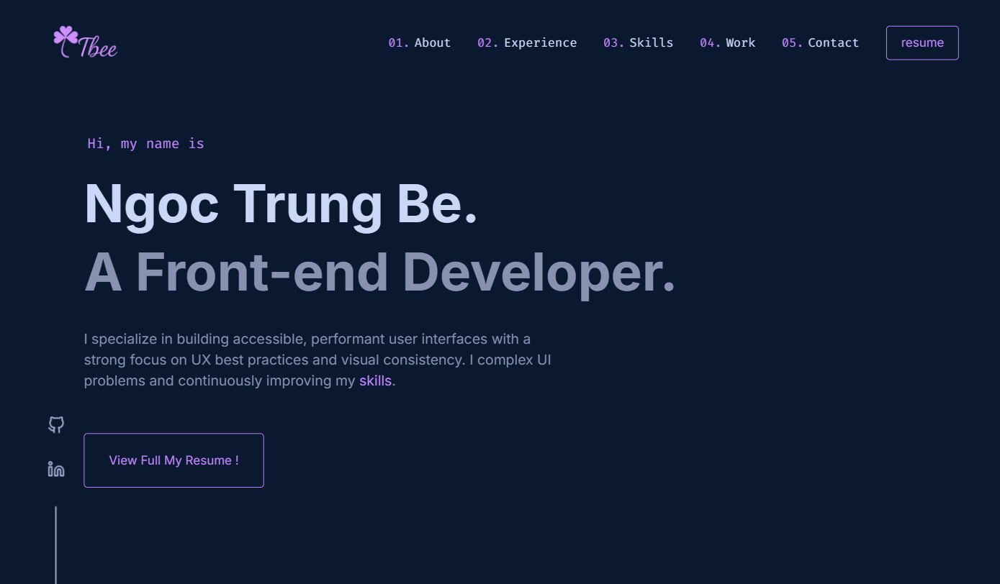

# Ngoc Trung Be | Front-End Developer Portfolio

A modern and responsive front-end portfolio website built with **Next.js**, **Tailwind CSS**, and **TypeScript**.  
It showcases real-world projects, UI/UX design consistency, and hands-on experience with technologies like **React**, **Framer Motion**, and more — with a strong focus on **performance**, **accessibility**, and **SEO best practices**.

[https://bengoctrung.dev](https://bengoctrung.com)

## ✨ Features

- Fully responsive layout across all devices
- Smooth page transitions and animations using **Framer Motion**
- Featured project showcase with clean UI
- Contact form integrated with **Web3Forms** for email submissions

## 🧰 Tech Stack

- **Framework**: Next.js 14 (App Router)
- **Languages**: TypeScript, SCSS
- **Styling**: Tailwind CSS, Framer Motion
- **Form Handling**: Web3Forms (email integration without backend)
- **Deployment**: Vercel

## 📬 Contact

📧 Email: [bengoctrung23@gmail.com](mailto:bengoctrung23@gmail.com)  
💼 LinkedIn: [https://www.linkedin.com/in/ngoc-trung-be-658342227/](https://www.linkedin.com/in/ngoc-trung-be-658342227/)  
🐙 GitHub: [https://github.com/NgocTrungBe/tbee-v1](https://github.com/NgocTrungBe/tbee-v1)

## 🙏 Inspiration

Design inspired by [Brittany Chiang](https://v4.brittanychiang.com/).
